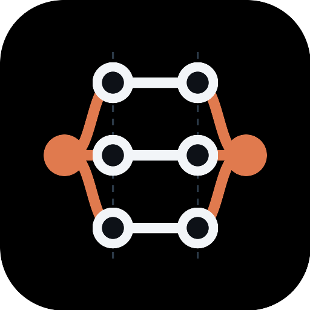

<p align="center">
  
</p>

<h1 align="center">claude-fork-join</h1>

<p align="center">
  Fork one Claude Code session into parallel-safe waves of worker sessions, then join on their state reports.
</p>

A Claude Code skill that turns one session into a **fork/join orchestrator**: it holds the
context, decomposes a large job into units of work, layers those units into waves that are
safe to run in parallel, and prints copy-paste prompts for separate Claude Code sessions.
Each of those sessions writes a state report file back to disk; the orchestrator reads the
reports and gates the next wave on them.

Not affiliated with or endorsed by Anthropic.

## Model

- **The orchestrator emits prompts. It does not spawn agents.** No subagents, no background
  tasks. You open each session yourself, so you keep per-session isolation, inspection, and
  cost control.
- **The only channel between sessions is a state report file** on disk, at a path the
  orchestrator assigns. The sessions share no memory.
- **The gate is hard.** A missing report is not success. A report without a terminal
  `status:` line is not success. Either one blocks the next wave.
- **Width is free, depth costs.** Every wave boundary is a serial round-trip through you,
  so the decomposition splits aggressively and depends sparingly.

## Install

### Plugin (recommended)

Inside any Claude Code session:

```
/plugin marketplace add hacknitive/claude-fork-join
/plugin install forkjoin
```

That points Claude Code at this repository directly — nothing is submitted to or hosted by
anyone else. `/plugin update forkjoin` picks up later releases; `/plugin uninstall forkjoin`
removes it.

### Manual

Copy into your Claude Code config directory (`~/.claude`, or whatever `CLAUDE_CONFIG_DIR`
points at):

```bash
git clone https://github.com/hacknitive/claude-fork-join.git
cd claude-fork-join
cp -r skills/forkjoin      ~/.claude/skills/
cp    commands/forkjoin.md ~/.claude/commands/
```

Restart Claude Code. `/forkjoin` is then available in every session.

### Requirements

Python 3.8+ on `PATH` — the deterministic half of the skill is a stdlib-only Python script
with no third-party dependencies.

| Platform | Status |
|---|---|
| Linux, WSL | works out of the box (`python3` ships with Ubuntu and Debian) |
| macOS | works once the Xcode Command Line Tools Python shim has been run at least once |
| Windows (Git Bash) | install Python from python.org first; the skill probes `python3`, `py -3`, then `python` |

Run artifacts are written under `tmp/runs/` in **your project's** working directory, never
inside the plugin directory.

## Usage

```
/forkjoin start  <goal>   # decompose into units, layer into waves, create the run
/forkjoin wave   <run>    # print the prompts for the next open wave
/forkjoin join   <run>    # read every report, verify terminal status, gate the next wave
/forkjoin status <run>    # snapshot: units, waves, report states, current gate
```

`<run>` is `current` (the run started in this session) or an explicit run id
(`YYYYMMDD-HHMMSS-goal-slug`).

Arguments are positional and have **no defaults** — a missing or unrecognized slot makes the
skill stop and ask rather than guess.

### Loop

1. `/forkjoin start "<your goal>"` — review the unit table and wave layering it proposes.
2. `/forkjoin wave current` — paste each printed prompt into its own Claude Code session.
3. Wait for those sessions to finish. Each writes its own report file.
4. `/forkjoin join current` — done / missing / blocked / failed.
5. Repeat from step 2 until every wave is closed.

## Run layout

Rooted at `tmp/runs/` inside the session's working directory:

```
<cwd>/tmp/runs/<run-id>/
├── units.json          # the manifest
├── RUN.md              # the orchestrator's durable memory
└── reports/
    ├── W1-P1-<unit-id>.md
    ├── W1-P2-<unit-id>.md
    └── …
```

Report filenames are label-first so the directory listing sorts by wave, then by prompt.

## Layout of this repo

| Path | Role |
|---|---|
| `skills/forkjoin/SKILL.md` | Decomposition rules, prompt template, report schema, mode persistence. |
| `skills/forkjoin/orchestrator.py` | Deterministic half — run scaffolding, wave layering, write-target collision detection, report gating. |
| `commands/forkjoin.md` | The `/forkjoin` slash command that routes into the skill. |
| `assets/` | Project imagery — `avatar.svg` / `avatar.png` (512×512) and `social-card.svg` / `social-card.png` (1280×640, GitHub social preview). SVGs are the sources. |

The model owns judgment (what the units are, what each session needs to know). The script
owns what must not be guessed (wave order, collisions, whether the gate opens).

## License

MIT — see [LICENSE](LICENSE).
